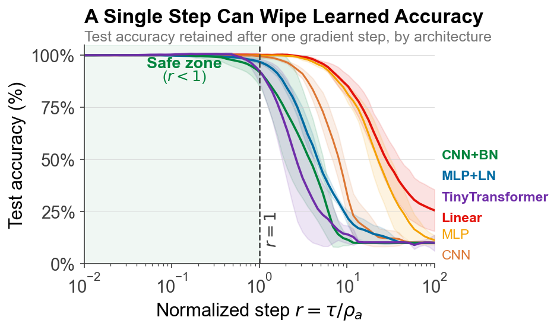

# Ghosts of Softmax

[](https://colab.research.google.com/github/piyush314/ghosts-of-softmax/blob/main/notebooks/fig1.ipynb)
[](LICENSE)

> **Ghosts of Softmax: Complex Singularities That Limit Safe Step Sizes in Cross-Entropy**
> [[arXiv]](https://arxiv.org/abs/2503.XXXXX)

Training in deep learning can still fail suddenly, even though we have spent a
lot of effort studying losses, curvature, and optimizers. A common way to
analyze optimization is to replace the true loss by a local Taylor
approximation and ask whether that approximation goes down after a step. The
problem is that a Taylor approximation is only trustworthy inside its radius of
convergence. Inside that radius, local analysis can be useful. Outside it, the
Taylor series may no longer track the true loss, so a step that looks safe from
first-, second-, or even third-order information can still be unsafe for the
real objective.

This question is usually ignored because the radius of convergence is hard to
compute directly. In deep learning, even first- and second-order quantities are
already expensive, so reasoning about all higher derivatives is usually out of
reach. Instead of trying to control the full Taylor series from real-line
derivatives, this project uses a different idea from complex analysis: the
radius of convergence is determined by the nearest singularity in the complex
plane.

For cross-entropy training, those singularities come from complex zeros of the
softmax partition function. Under a logit-linearization assumption, this gives
a practical way to estimate a local convergence radius from quantities we can
compute cheaply, such as finite differences or Jacobian--vector products. That
leads to a simple question for any proposed update: is this step still inside
the local convergence radius, or has it already gone beyond the region where
Taylor-based reasoning is reliable?

This repository is the code companion to the paper. It is designed to help
newcomers understand the idea step by step. The tutorials explain the basic
radius calculations, the notebooks reproduce the main paper figures, and the
experiment scripts show how to use a radius-based controller in practice. The
controller is simple: if an optimizer proposes a step that is larger than the
estimated local convergence radius, rescale the step so it stays within that
radius.


*Test accuracy retained after one gradient step. All architectures
collapse once the normalized step r = τ/ρ_a exceeds 1.*

## Install

Requires Python 3.10+. GPU optional but recommended for experiment scripts.

```bash
pip install -r requirements.txt
pip install --no-build-isolation -e .
```

## Start Here

Use the repo in one of three ways:

1. Reproduce a headline result quickly.

   Start with [`notebooks/fig1.ipynb`](notebooks/fig1.ipynb), which reproduces
   the phase transition near r = 1 in a lightweight setting.

2. Learn the ideas in order.

   Work through the [tutorials](#tutorials) in sequence.

3. Run the experiment scripts directly.

   Start with [`experiments/phasetransition/run.py`](experiments/phasetransition/run.py)
   or [`experiments/lrspike/run.py`](experiments/lrspike/run.py), then use the
   experiment contracts and READMEs to scale up to the full paper runs.

## Validation

Check the install before running heavier experiments:

```bash
pytest
GHOSTS_RUN_SMOKE=1 pytest tests/test_smoke_runs.py -q
```

## Reproduce Paper Figures

| Figure | Description | Notebook | Colab | Runtime |
|--------|-------------|----------|-------|---------|
| Fig 1 | Phase transition | [`fig1.ipynb`](notebooks/fig1.ipynb) | [](https://colab.research.google.com/github/piyush314/ghosts-of-softmax/blob/main/notebooks/fig1.ipynb) | ~5 min |
| Fig 7 | JVP phase transition | [`fig7.ipynb`](notebooks/fig7.ipynb) | [](https://colab.research.google.com/github/piyush314/ghosts-of-softmax/blob/main/notebooks/fig7.ipynb) | ~5 min |
| Fig 9 | Temperature fingerprint | [`fig9.ipynb`](notebooks/fig9.ipynb) | [](https://colab.research.google.com/github/piyush314/ghosts-of-softmax/blob/main/notebooks/fig9.ipynb) | ~10 min |
| Fig 10 | Architecture grid | [`fig10.ipynb`](notebooks/fig10.ipynb) | [](https://colab.research.google.com/github/piyush314/ghosts-of-softmax/blob/main/notebooks/fig10.ipynb) | ~15 min |
| ResNet-18 | CIFAR-10 instability | [`resnet18.ipynb`](notebooks/resnet18.ipynb) | [](https://colab.research.google.com/github/piyush314/ghosts-of-softmax/blob/main/notebooks/resnet18.ipynb) | ~30 min |

## Tutorials

| Notebook | Topic |
|----------|-------|
| [`01_binary_radius.ipynb`](tutorials/01_binary_radius.ipynb) | Binary softmax convergence radius |
| [`02_kl_bound.ipynb`](tutorials/02_kl_bound.ipynb) | KL divergence bound |
| [`03_rho_controller.ipynb`](tutorials/03_rho_controller.ipynb) | Rho-adaptive controller |

## Experiments

Each experiment has a canonical `run.py`. Some also include separate plotting
scripts or notebook entry points; the experiment README and `contract.json` are
the source of truth for outputs and reproduction commands.

| Directory | Paper result |
|-----------|-------------|
| `experiments/phasetransition/` | Phase transition at r = 1 |
| `experiments/lrspike/` | LR spike controller comparison |
| `experiments/tempfingerprint/` | Temperature-scaling fingerprint |
| `experiments/archgrid/` | Cross-architecture spike comparison |
| `experiments/tfmbottlenecks/` | Transformer bottleneck analysis |
| `experiments/resnetnatural/` | ResNet-18/CIFAR-10 natural instability |
| `experiments/randomdirs/` | Random-direction validation |

```bash
python experiments/phasetransition/run.py
```

## Core Library

`src/ghosts/` contains reusable modules:

- `radii.py` — softmax convergence radius computation
- `control.py` — rho-adaptive controller
- `models.py` — small transformer
- `theory.py` — KL divergence bound
- `hooks.py` — model instrumentation

## Citation

```bibtex
@article{ghosts2026,
  title   = {Ghosts of Softmax: Complex Singularities That Limit Safe Step Sizes in Cross-Entropy},
  author  = {Piyush Sao},
  year    = {2026},
  journal = {arXiv preprint arXiv:2503.XXXXX},
}
```

## License

MIT
